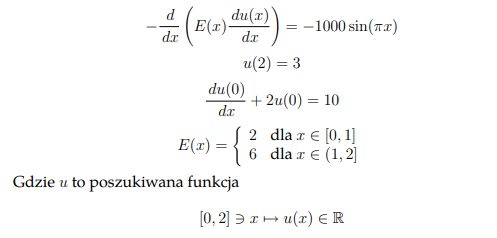

# ProjektRurki
Projekt z Równań Różniczkowych i Różnicowych

Projekt polega na rozwiązaniu podanego niżej równania różniczkowego za pomocą Metody Elementów Skończonych i napisaniu programu generującego układ równań liniowych, rozwiązującego wygenerowany układ równań liniowych oraz rysujący wykres rozwiązania

## 4.3 Odkształcenie sprężyste

