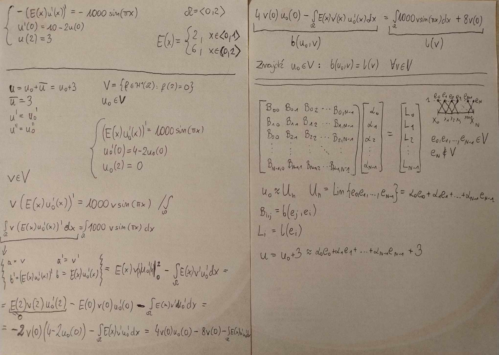

# Projekt z Równań Różniczkowych i Różnicowych

## Cel projektu

Projekt polega na rozwiązaniu podanego niżej równania różniczkowego za pomocą **Metody Elementów Skończonych (MES)**. W ramach projektu należy:

1. Znaleźć sformułowanie słabe równania.
2. Wygenerować układ równań liniowych.
3. Rozwiązać wygenerowany układ równań liniowych.
4. Narysować wykres rozwiązania.

## Zadanie: Odkształcenie sprężyste

Ilustracja równania:

## Znalezienie sformułowania słabego i układu równań

Rozwiązanie zostało przedstawione poniżej:

## Przykładowy wykres

Poniższy wykres przedstawia wyniki otrzymane za pomocą zaimplementowanego algorytmu (dla N = 15):

---
