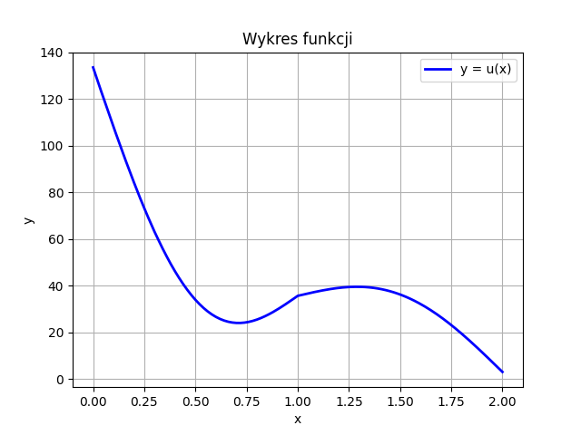

# 📘 Projekt z Równań Różniczkowych i Różnicowych

## 🎯 Cel projektu

Projekt dotyczy rozwiązania równania różniczkowego przy użyciu **Metody Elementów Skończonych (MES)**.

## 📝 Opis problemu

Rozważany model opisuje **odkształcenie sprężyste**, a jego matematyczny zapis przedstawia poniższe równanie:


## 🧩 Metoda rozwiązania

Rozwiązanie problemu zostało uzyskane poprzez następujące etapy:

1. Wyznaczenie **sformułowania słabego** równania.
2. Wygenerowanie układu równań liniowych.
3. Rozwiązanie układu równań.
4. Wizualizacja wyników za pomocą wykresu.


## 📊 Wyniki

Poniższy wykres przedstawia otrzymane wyniki dla **N = 300**.



## 🚀 Uruchomienie kodu

Aby uruchomić projekt, wykonaj następujące kroki:

1. Upewnij się, że masz zainstalowanego **Pythona 3.x** oraz wymagane biblioteki:

   ```bash
   pip install matplotlib scipy
   ```

2. Uruchom skrypt:

   ```bash
   python kod_do_projektu.py
   ```

Po uruchomieniu skryptu zostanie wygenerowany wykres przedstawiający rozwiązanie równania.

## 📂 Struktura projektu

```
 📁 differential_equations_project
  │── 📄 kod_do_projektu.py        # Główny skrypt projektu
  │── 📄 README.md                 # Dokumentacja projektu
  │── 📄 rownanie.png              # Ilustracja równania
  │── 📄 rozwiazanie.png           # Wyprowadzenie sformułowania słabego
  │── 📄 wykres.png                # Wykres uzyskanego rozwiązania
```

## ✍️ Autor

Projekt wykonany w ramach kursu **Równań Różniczkowych i Różnicowych**.

**Autor:** Pior Świerzy
